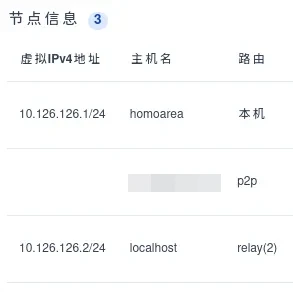

## 工具介绍
* [**sunshine**](https://github.com/LizardByte/Sunshine/releases): 串流服务端,安装在被控主机上
* [**moonlight**](https://moonlight-stream.org/): 串流客户端,安装在操作主机上
* [**easytier-gui**](https://easytier.cn/): 傻瓜式的虚拟组网工具,用于网络连接

## 搭建流程

流程很简单,首先使用easytier将被控主机和操作主机组建虚拟网,在被控主机部署 sunshine,在操作主机启动 moonlight并添加被控主机的ip地址.然后开始配对,在被控主机sunshine web控制台输入相应的PIN码和主机名.稍等片刻就可以进行远程控制了.

tips: 如果画面直接卡住或卡顿,在moonlight设置中降低视频码率很有用

下面是详细流程:

1. 设置easytier
   参见[官方文档](https://easytier.cn/guide/gui/basic.html),设置相同网络名,密码和初始节点ip,初始节点可参考[EasyTier 公共服务器列表](https://easytier.gd.nkbpal.cn/status/easytier)

   启动后会得到如下
   
2. sunshine
   安装后打开webUI,首次进入会要求设置用户名和密码,设置后重新登录.
   可以在设置中设置简体中文
3. moonlight
   添加被控主机ip,比如我这里是 10.126.126.1

如果你的NAT类型对p2p受限,以至于使用公共服务器进行转发的话大概率速度不行,请设置moonlight视频码率在较小的范围,比如 0.5-3 Mbps

如果你有自己的服务器,可以参考easytier官方文档安装easytier-cli后[创建自己的共享节点](https://easytier.cn/guide/network/host-public-server.html),初始节点填入公网ip即可

参见 [文档安装为 Linux Systemd 服务](https://easytier.cn/guide/network/install-as-a-systemd-service.html)
```
# cat /etc/systemd/system/easytier.service

[Unit]
Description=EasyTier Service
After=network.target syslog.target
Wants=network.target

[Service]
Type=simple
ExecStart=<path_to_easytier-core>  --network-name <your_network_name>  --network-secret <your_secret> --private-mode true
Restart=always
RestartSec=3
LimitNOFILE=1048576
Environment=TOKIO_CONSOLE=1

[Install]
WantedBy=multi-user.target

```
